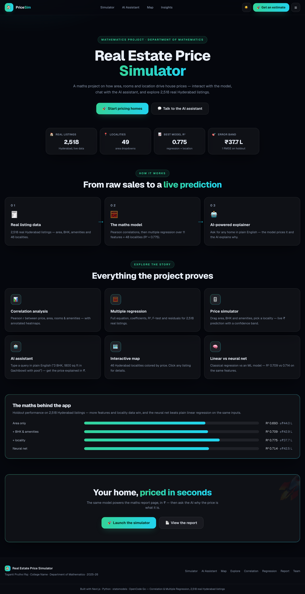
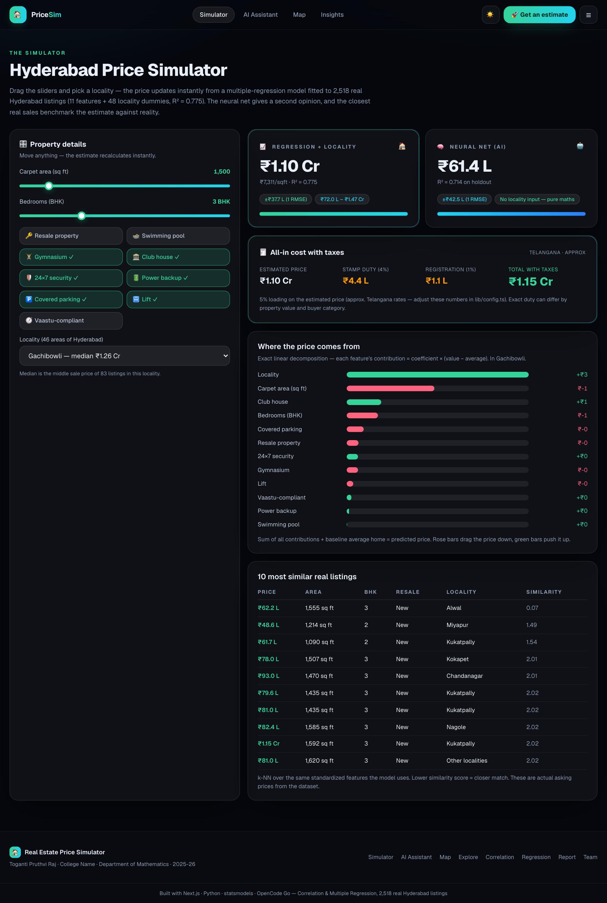
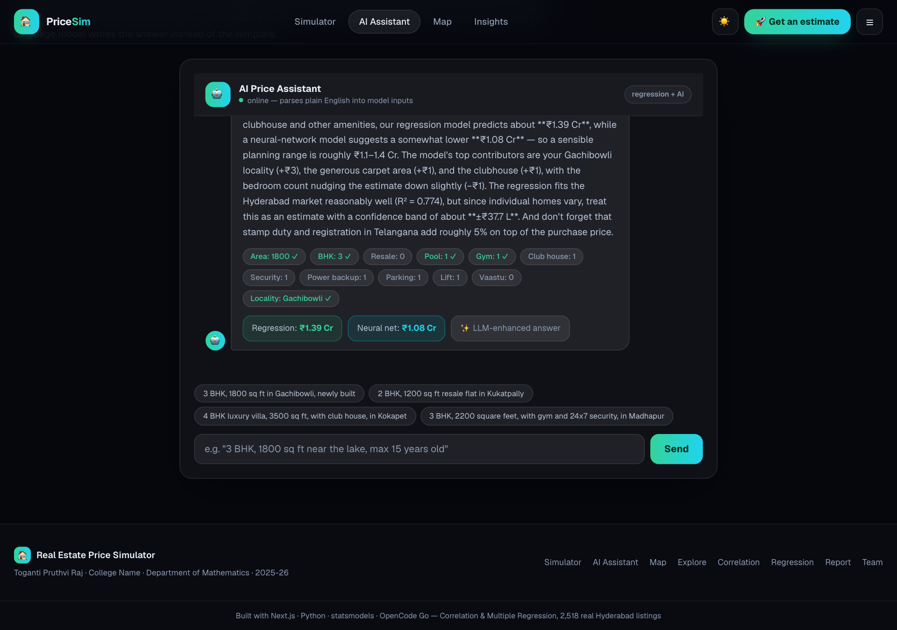
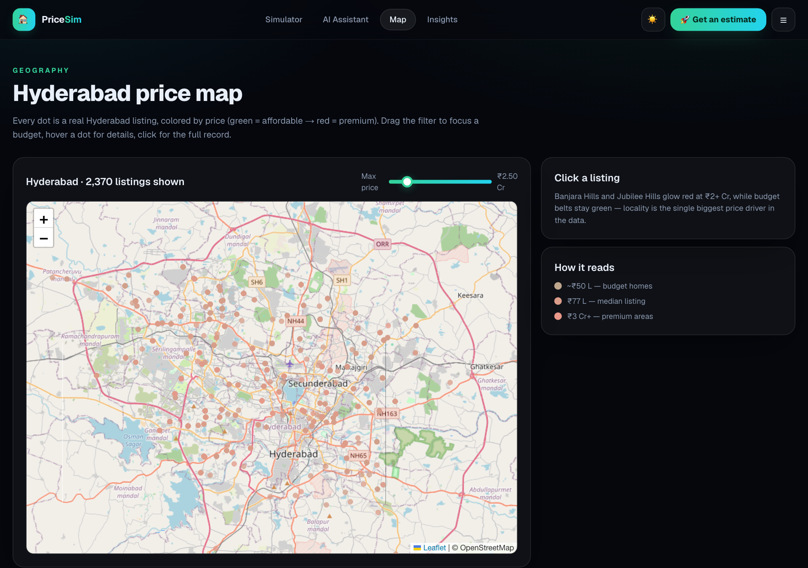
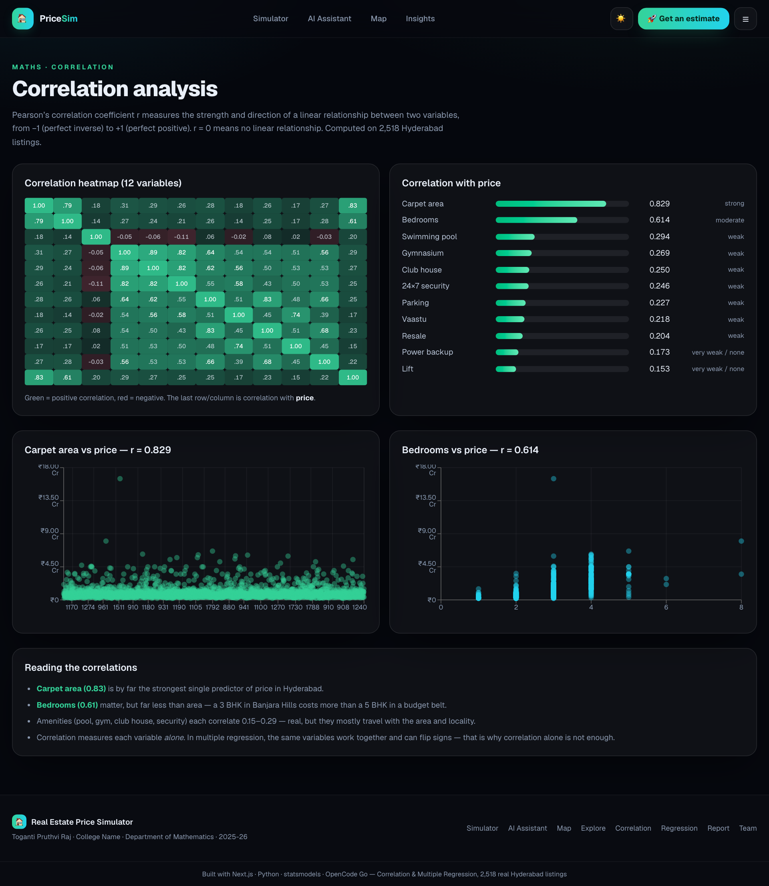
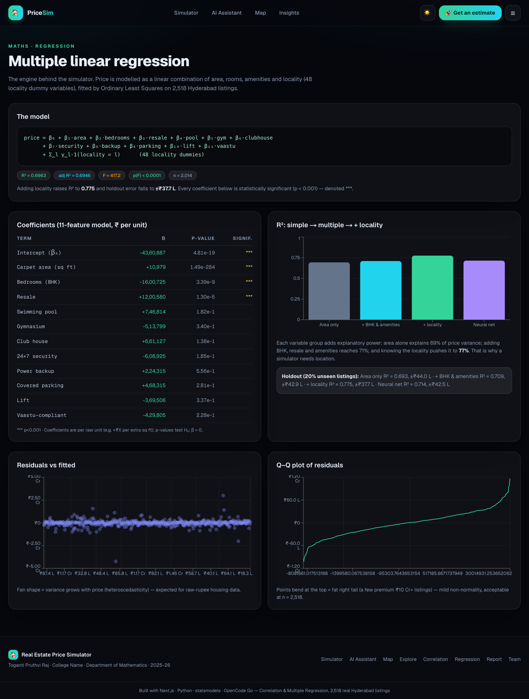

# 🏠 Real Estate Price Simulator

**Correlation & Multiple Regression, powered by AI** — a mathematics project that prices
real Hyderabad properties in Indian rupees, explains itself with an LLM, and ships as a
production-quality Next.js app.

<p align="center">
  
</p>

<p align="center">
  <a href="https://github.com/prutxvi/real-estate-price-simulator/blob/main/LICENSE"></a>
  <a href="https://img.shields.io/badge/Next.js-16-black?logo=next.js"></a>
  <a href="#"></a>
  
  
</p>

---

## ✨ Features

| | |
|---|---|
| 🎚️ **Live ₹ simulator** | Area, BHK, new/resale, 9 amenity toggles and 48 localities → instant price from the fitted regression, with a confidence band and ₹/sqft. |
| 🧾 **All-in cost card** | Stamp duty (4%) + registration (1%) estimates → total cost in ₹, Telangana rates, adjustable in config. |
| 🤖 **AI price assistant** | Type "3 BHK, 1800 sq ft in Gachibowli with pool and gym" → parses it, runs the model, and a real LLM (OpenCode Go) explains the number. Offline engine fallback so demos never break. |
| 🗺️ **Hyderabad map** | Every listing as a dot on OpenStreetMap, colored by price; click any dot for the full record. |
| 📊 **Maths pages** | Correlation heatmaps, coefficient tables, residual & Q–Q diagnostics — the actual viva material. |
| 📄 **Print-ready report** | One page, every chart and stat, "Save as PDF" button. |
| 🌗 **Light/dark theme** | Memory-backed theme switch, glass surfaces, gradient accents. |

## 📸 Screenshots

| | |
|---|---|
|  |  |
|  |  |
|  | |

## 📈 The maths (holdout, 20% unseen listings)

| Model | R² | RMSE |
|---|---|---|
| Area only | 0.693 | ₹43.99 L |
| 11 features (BHK, resale, amenities) | 0.709 | ₹42.86 L |
| **+ 48 localities** | **0.775** | ₹37.68 L |
| Neural net (same 11 features) | 0.714 | ₹42.46 L |

> The story the project tells: **carpet area is the strongest single driver (r = 0.83), but locality decides the rest** —
> a 1,500 sq ft 3-BHK ranges from ~₹64 L (Nizampet) to ~₹1.63 Cr (Banjara Hills) on the same inputs.

## 🧱 Tech stack

- **Pipeline** — Python · pandas · NumPy · statsmodels · scikit-learn · matplotlib
- **App** — Next.js 16 (TypeScript) · Tailwind CSS · Recharts · React-Leaflet · OpenCode Go (LLM)
- **Data** — 2,518 real Hyderabad sale listings (asking prices), 48 localities, 40 source columns

## 🚀 Quickstart

**Analysis pipeline** (Python 3.12):

```bash
python -m venv .venv && source .venv/bin/activate
pip install -r scripts/requirements.txt

python scripts/prep_hyderabad.py            # clean + coordinates + locality grouping
python scripts/train_export_hyderabad.py    # fit models, export JSON artifacts into web/
python scripts/make_figures_hyderabad.py    # report figures
# each script prints holdout R² / RMSE — CI runs all three on every push
```

**Web app** (Node 22+):

```bash
cd web
npm ci
cp .env.example .env.local   # optional — app runs offline without it
npm run build && npm start   # http://localhost:3000
# or in dev: npm run dev
```

`web/.env.local` (never committed) configures the AI assistant:

```
OPENCODE_GO_API_KEY=your_key
OPENCODE_GO_BASE_URL=https://opencode.ai/zen/go/v1
OPENCODE_GO_MODEL=glm-5.3-flash
```

Without a key the assistant uses a deterministic offline engine — the demo works anywhere.

## 📁 Project structure

```
real-estate-price-simulator/
├── data/                        # raw + cleaned Hyderabad datasets
├── scripts/
│   ├── prep_hyderabad.py        # cleaning, coordinates, locale grouping
│   ├── train_export_hyderabad.py# OLS + MLP training → JSON artifacts
│   ├── make_figures_hyderabad.py
│   └── requirements.txt
├── web/                         # Next.js application
│   ├── app/                     # pages + API routes (predict, similar, assistant, stats)
│   ├── lib/                     # inference engine, LLM client, parser, config
│   ├── components/              # nav, theme, leaflet map, UI kit
│   └── public/data/             # exported model artifacts (served + bundled)
├── screenshots/
├── .github/workflows/ci.yml     # pipeline + web-build CI
└── LICENSE · CONTRIBUTING.md · CHANGELOG.md
```

## 📖 Data & methodology

- **Source**: 2,518 Hyderabad residential listings (public listing-site data, asking prices).
- **Features**: carpet area, BHK, new/resale, swimming pool, gymnasium, club house, 24×7 security,
  power backup, covered parking, lift, Vaastu compliance + 48 locality dummies.
- **Modelling**: Pearson correlations → OLS with dummy variables → MLP (sklearn, same features)
  → exported as JSON and re-implemented in TypeScript so the app is fully serverless-friendly.
- **Honesty note**: asking prices, not closed deals — flagged inside the app wherever medians are shown.

## 🤝 Contributing

See [CONTRIBUTING.md](CONTRIBUTING.md). PRs welcome — pipeline and app CI run on every push.

## 📄 License

[MIT](LICENSE) © 2026 Toganti Pruthvi Raj
